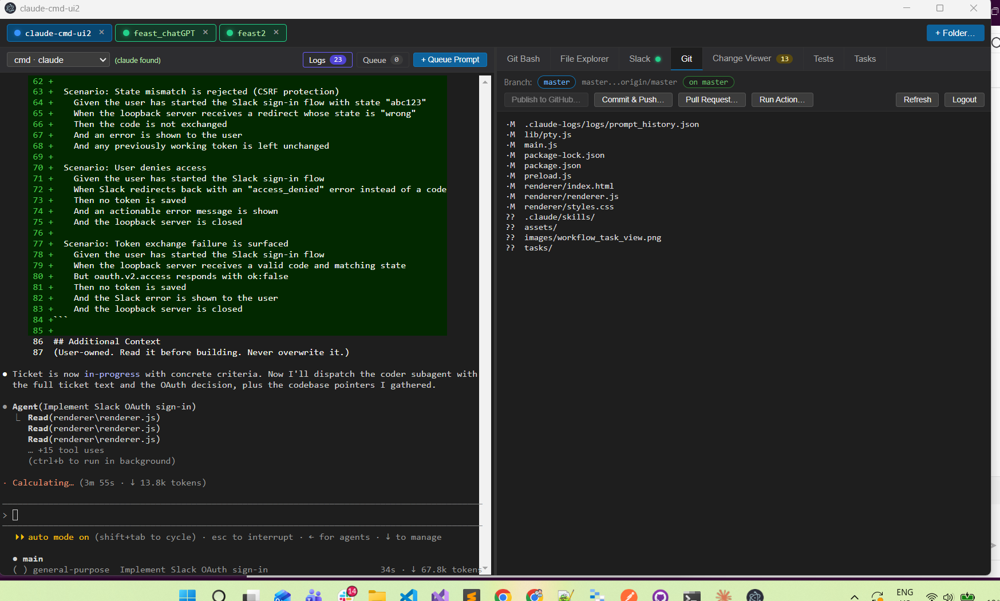
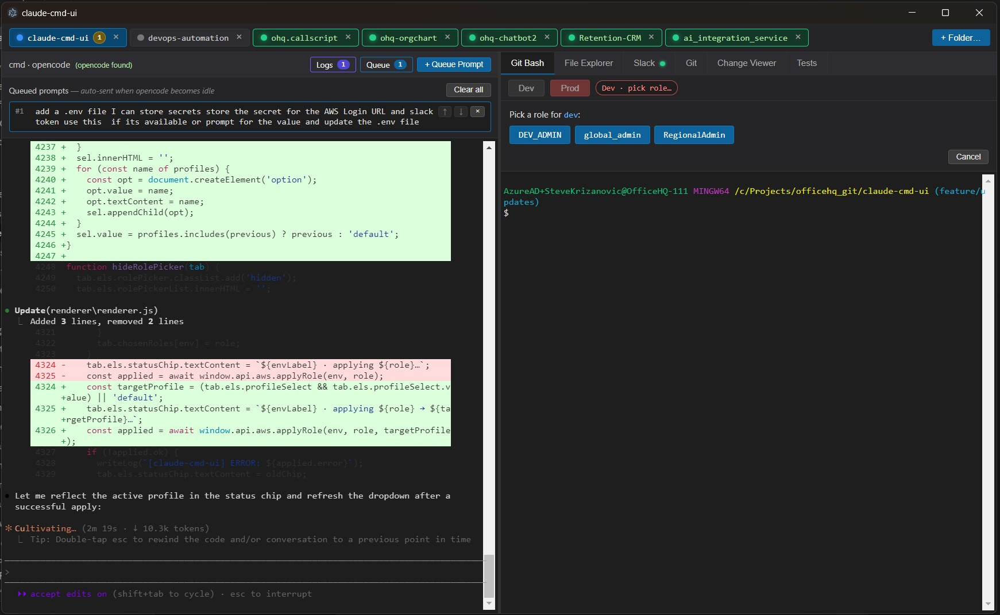
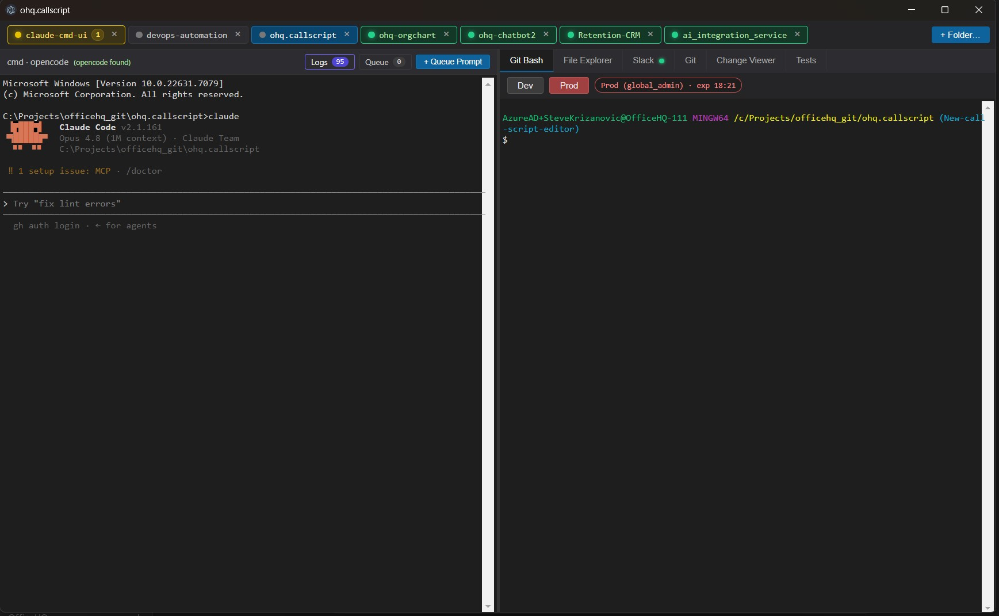
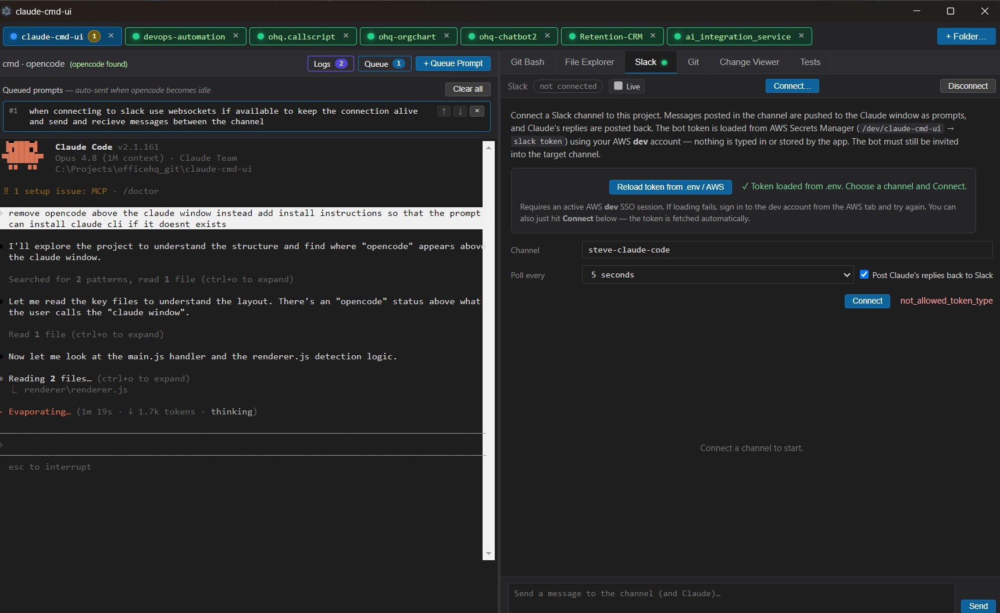
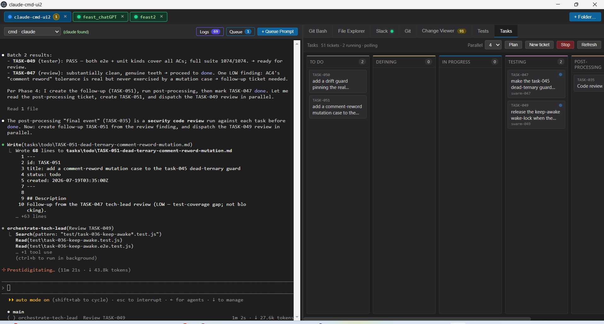

# Claude CMD UI

A cross-platform Electron desktop app that wraps an AI coding CLI (`claude`) and a
shell terminal side-by-side, then layers a full project cockpit around them: a
file explorer with search and inline editing, a Git/GitHub panel, a diff &
merge-conflict viewer, a test runner, a Slack bridge, a ticket-driven **Tasks
kanban board** with a multi-agent "orchestrate" build workflow, and a
multi-account AWS SSO credential switcher.

The goal is to drive an AI coding agent from a single window — queue up prompts,
watch it work, review the diffs it produces, commit & push, open a PR, run a
GitHub Action, and (optionally) relay the whole conversation to and from a Slack
channel — without leaving the app.

> **Platform:** Runs on Windows and macOS, with Linux as best-effort (expected to
> work, less tested). On Windows the two panes are `cmd.exe` and Git Bash
> (`C:\Program Files\Git\bin\bash.exe`) and CLIs live at fixed install paths; on
> macOS/Linux both panes are your login shell (`$SHELL`, defaulting to zsh on macOS
> and bash on Linux) and the CLIs (`git`, `aws`) resolve from `PATH`. See
> [docs/cross-platform.md](docs/cross-platform.md).

**Who it's for:** developers using an agent CLI (primarily Anthropic's `claude`)
who want a single cockpit for prompting, reviewing, versioning, and shipping.

---

## Table of contents

- [Overview](#overview)
- [Features](#features)
- [Architecture](#architecture)
- [Requirements](#requirements)
- [Installation](#installation)
- [Quick start](#quick-start)
- [The window at a glance](#the-window-at-a-glance)
- [Configuration](#configuration)
- [Development and testing](#development-and-testing)
- [Tasks board & the Orchestrate workflow](#tasks-board--the-orchestrate-workflow)
- [Team tab & dynamic workflow](#team-tab--dynamic-workflow)
- [Data and files written](#data-and-files-written)
- [Documentation](#documentation)
- [Security notes](#security-notes)
- [Project layout](#project-layout)

---

## Overview

The app follows the standard Electron split with context isolation enabled: a
privileged main process, a locked-down preload bridge, and a sandboxed renderer.
Terminals are real PTY processes (via
[`@lydell/node-pty`](https://github.com/lydell/node-pty) — ConPTY on Windows)
rendered with [xterm.js](https://xtermjs.org/), so the embedded shells behave
like normal terminals (colours, TUIs, resize, copy/paste). Every feature is one
tab of a single window; open multiple project folders and each gets its own tab
with its own pair of terminals and its own state.

## Features

Each feature has its own page under [`docs/`](docs) — click through for details,
usage, and API/IPC references.

- **[Electron app shell & windowing](docs/app-shell.md)** — the main process,
  the single window, lifecycle, and per-folder session persistence.
- **[IPC bridge (`window.api`)](docs/ipc-bridge.md)** — the `contextBridge`
  surface the renderer uses to reach every privileged operation.
- **[Terminals & PTY integration](docs/terminals.md)** — the `cmd`/`claude`,
  Git Bash, and worker (`gemini`/`codex`) panes, with CLI auto-launch and idle
  detection.
- **[Prompt queue](docs/prompt-queue.md)** — line up prompts and auto-dispatch
  them one at a time as the agent goes idle.
- **[Prompt history & cloud sync](docs/prompt-history.md)** — per-project prompt
  log with token/cost estimates and optional Lambda-backed sync.
- **[File Explorer, editor & search](docs/file-explorer.md)** — lazy tree, inline
  editor, content/file search, and a **Show preview** toggle that renders `.md`
  files as formatted HTML and back to raw source (dependency-free, no new npm
  dependency).
- **[Git & GitHub integration](docs/git-github.md)** — branch tracking, commit &
  push (protected-branch guards), publish, pull requests, and Actions dispatch.
- **[Change Viewer](docs/change-viewer.md)** — colorized diffs and an interactive
  merge-conflict resolver.
- **[Tests tab](docs/tests-tab.md)** — discover and run unit vs. UI/e2e tests.
- **[AWS SSO environment switcher](docs/aws-sso.md)** — discover accounts, pick a
  role, and rewrite `~/.aws/credentials`.
- **[Slack bridge](docs/slack-bridge.md)** — two-way channel/agent proxy via a
  `SLACK_TOKEN` bot token or the **Sign in with Slack** OAuth flow.
- **[Slack integration — thread commands & continuous output](docs/slack-integration.md)** —
  in-thread `tasks`/`help`/`status` commands, 30s continuous output flushing, and
  secret redaction / mention defang on everything the app posts.
- **[Tasks board & the Orchestrate workflow](docs/orchestrate-workflow.md)** —
  the ticket-driven kanban board and its multi-agent build swarm.
- **[Ticket archiving](docs/ticket-archiving.md)** — stale done tickets (last
  activity > 5 days old) fold into a collapsible "Archived (N)" expander at the
  bottom of the Done lane (derived, no file move, no new status).
- **[BA planner clarifying questions](docs/ba-planner-clarifying-questions.md)** —
  Phase-1 planning surfaces clarifying questions and the orchestrator gets every
  one answered (AskUserQuestion or the ticket question/answer frontmatter) before
  planning completes.
- **[Per-activity ticket cost log](docs/ticket-cost.md)** — each ticket records a
  per-activity (ba/code/test/review/post-processing) cost log — model, timing,
  tokens, and cost — surfaced as a cost view in the ticket modal.
- **[Usage & telemetry](docs/telemetry.md)** — turn on Claude Code's built-in
  OpenTelemetry from the Team tab; a loopback receiver shows live tokens & cost
  in-app and can forward a compact JSON summary to a URL you choose.
- **[Keep-awake wake-lock](docs/keep-awake.md)** — hold the OS awake while builds
  run.
- **[Attention when waiting for input](docs/window-attention.md)** — pulse the
  waiting tab's dot and flash the OS taskbar when Claude needs input and the
  window is unfocused.
- **[Configuration & environment](docs/configuration.md)** — every env var and
  state file in one place.



*The Git/GitHub panel — branch tracking, commit & push, publish, pull requests, and workflow dispatch.*

## Architecture

- **[`main.js`](main.js)** — the main (Node) process. Owns the `BrowserWindow`,
  spawns PTYs, and implements every privileged operation behind
  `ipcMain.handle(...)` channels: folder picking, filesystem helpers
  (read/write/rename/grep/find), Git (via `execFile('git', …)`), GitHub via the
  `gh` CLI, prompt-history persistence, and the AWS/Slack bridges.
- **[`preload.js`](preload.js)** — the secure bridge. Uses `contextBridge` to
  expose a single `window.api` object; the renderer never touches Node directly.
- **[`renderer/`](renderer)** — the UI (plain HTML/CSS/JS, no framework).
  `index.html` defines the layout and a per-tab `<template>`; `renderer.js`
  drives all interaction; `styles.css` themes it.
- **[`lib/`](lib)** — Electron-free main-process helpers: `pty.js` (PTY spawn +
  CLI auto-launch), `aws.js` (SSO), `slack.js` / `slack-oauth.js` /
  `slack-proxy.js` (Slack), `env-store.js` (`.env`), `cloud-logs.js` (cloud
  sync), `markdown.js` (preview renderer), `keep-awake.js` (wake-lock decision),
  `orchestrate-agents.js`, and the `ticket-*.js` board helpers.
- **[`.claude/skills/orchestrate/`](.claude/skills/orchestrate/SKILL.md) +
  `.claude/agents/`** — the orchestrate skill and the subagent definitions.
- **[`lambda/prompt-logs/`](lambda/prompt-logs/index.mjs)** — an optional AWS
  Lambda that stores prompt history in CloudWatch Logs.

## Requirements

| Tool | Why | Notes |
|------|-----|-------|
| **Node.js + npm** | Build/run the app | Ships Electron `^34.5.8` |
| **Git** | Git Bash pane (Windows) + all Git operations | **Windows:** Git for Windows, Git Bash expected at `C:\Program Files\Git\bin\bash.exe`. **macOS/Linux:** `git` on `PATH` (the panes use your login shell, not Git Bash) |
| **`claude` CLI** | The AI agent that runs in the cmd pane | Optional — the app offers to install it if missing |
| **GitHub CLI (`gh`)** | Publish, PRs, Actions | Optional — only the Git tab needs it |
| **AWS CLI v2** | SSO account/role switching | **Windows:** fixed path `C:\Program Files\Amazon\AWSCLIV2\aws.exe`. **macOS/Linux:** `aws` resolved from `PATH` |
| **`gemini` / `codex`** | Optional worker CLIs | Only if you use the worker shell |

Runtime dependencies (from [`package.json`](package.json)): `@lydell/node-pty`
`^1.1.0`, `@xterm/xterm` `^5.5.0`, `@xterm/addon-fit` `^0.10.0`. Dev/build:
`@electron-forge/cli` `^7.6.0`, `electron` `^34.5.8`.

Most integrations degrade gracefully: if `gh`, `claude`, or AWS aren't present,
the rest of the app still works and the relevant tab shows install/sign-in
guidance.

## Installation

```bash
npm install
```

## Quick start

```bash
npm run start      # cross-platform entry point (electron-forge start)
```

`npm run start` is the supported entry point on every platform. On Windows,
`run.bat` is a convenience wrapper that runs the same command. On macOS, launching
from Finder inherits a minimal `PATH`, so the app augments `PATH` at startup to
find Homebrew/local CLIs (`git`, `claude`, `gh`, `aws`, `opencode`) — see
[docs/cross-platform.md](docs/cross-platform.md).

On first launch you'll see an empty state — open a project folder from the UI.
Open folders are remembered and reopened on the next launch. DevTools open
automatically (detached); set `OPEN_DEVTOOLS=0` to suppress that, and use
`Ctrl+Shift+I` or `F12` to toggle them.

## The window at a glance



*The main working screen — the `claude` REPL on the left, the tabbed right-hand surface, and the queue/logs panels below.*

- **Left pane:** the `cmd` terminal running `claude`, plus the prompt **Queue**
  and **Logs** panels.
- **Right pane:** a tabbed surface — Git Bash, File Explorer, Slack, Git, Change
  Viewer, Tests, and the **Tasks** board.
- A draggable **splitter** sets the left/right ratio; terminals re-fit on release.

Each workspace tab carries a **status dot** (idle / busy / waiting / finished) and
a badge showing the number of queued prompts.



*A tab flips to the green **finished** state once the agent goes idle after producing output.*



*Queue up prompts and let the app auto-dispatch them one at a time as the agent goes idle.*

## Configuration

Secrets and settings come from a project-root `.env` file (read/written by
[`lib/env-store.js`](lib/env-store.js)); see
[docs/configuration.md](docs/configuration.md) for the full reference. Key
variables:

| Variable | Default | Purpose |
|----------|---------|---------|
| `OPEN_DEVTOOLS` | (unset → open) | Set `0` to stop DevTools opening on launch |
| `AWS_SSO_START_URL` | (required for AWS) | SSO portal start URL; prompted and saved on first use |
| `AWS_DEV_ACCOUNT_ID` / `AWS_PROD_ACCOUNT_ID` | (none) | Account ids for legacy profile sync |
| `SLACK_TOKEN` | (required to connect) | Slack bot token `xoxb-…` (or user token `xoxp-…` written by OAuth) |
| `SLACK_APP_TOKEN` | (none) | App-level token `xapp-…` to enable Socket Mode |
| `SLACK_CLIENT_ID` / `SLACK_CLIENT_SECRET` | (none) | OAuth app credentials for **Sign in with Slack** |
| `CLOUD_LOG_ENDPOINT` | (unset → disabled) | Prompt-logs Lambda URL for cloud sync |
| `CLOUD_LOG_API_KEY` / `CLOUD_LOG_USERNAME` | (none / OS user) | Cloud-sync secret and username tag |

State that is not in `.env` lives as JSON in Electron's userData dir
(`session.json`, `status.json`) — see [Data and files written](#data-and-files-written).

## Development and testing

```bash
npm run start      # run the app (electron-forge start)
npm run package    # package the app with electron-forge
npm run make       # build distributables
npm test           # run the test suite: node --test "test/**/*.test.js"
```

Tests are plain [`node --test`](https://nodejs.org/api/test.html) suites in
[`test/`](test) — no extra test-runner dependency. The Electron-free `lib/`
modules (`ticket-*.js`, `keep-awake.js`, `markdown.js`, `slack-*.js`,
`env-store.js`, …) are unit-testable in isolation; run a single file with, e.g.:

```bash
node --test test/ticket-queue.test.js
```

> **Note:** editing any instruction file under `.claude/` requires syncing its
> byte-for-byte copy under `assets/` or the drift-guard tests fail.

> **Note:** when a test needs to exercise `renderer.js`/`main.js`/`preload.js`
> logic that has no real `module.exports` to `require()` (renderer.js is a
> plain browser script, not a CommonJS module), extract and invoke the REAL
> function from source — see the `extractFn` + isolated `Function`-scope
> pattern in `test/task-162-telemetry-scope-consistency.e2e.test.js` and
> `test/task-157-stats-per-project.test.js` — rather than asserting against
> source text with regex or hand-rolling a copy of the logic inside the test.
> Both of those alternatives can pass even when the real implementation
> regresses. When a module genuinely does export the function (e.g.
> `preload.js`), prefer `require()`-ing the real export directly instead (see
> `test/task-164-preload-telemetry-bridge.test.js`).

## Tasks board & the Orchestrate workflow

The **Tasks** tab is a live kanban board for ticket-driven development: you plan a
feature into tickets, review them, and let a set of AI subagents build, test, and
review them while you watch progress move across the lanes. Full details are in
[docs/orchestrate-workflow.md](docs/orchestrate-workflow.md).



*The Tasks board — one lane per status, with per-ticket build time, cost, and token markers.*

**Tickets are files** under `tasks/` with flat frontmatter (`id`, `title`,
`status`, `created`, `updated`, plus optional extras) and `## Description`,
`## Acceptance Criteria`, `## Cucumber Tests`, and a user-owned
`## Additional Context` section.

**Six lanes**, left to right:
`todo → defining → in-progress → testing → post-processing → done`. The
`failed-testing` status is still valid and claimable but has no dedicated lane —
its cards fold into **testing** with a red marker.

**Agent roles** driven by the `orchestrate` skill
([`.claude/skills/orchestrate/SKILL.md`](.claude/skills/orchestrate/SKILL.md)):
the **business-analyst** turns a request into tickets, the **coder** implements
one ticket in its own isolated branch/worktree, the **tester** writes e2e cucumber
+ unit tests, and a **tech-lead** reviews before done. Drive it with
`/orchestrate plan <feature>`, `/orchestrate build`, and `/orchestrate status`.

**Accounting.** Each ticket records how long its build took and what it cost — the
board shows per-ticket **build time**, **cost**, and estimated **token** usage,
and every re-run appends to a durable run log.

## Team tab & dynamic workflow

The **Team** tab is a per-project control surface for the orchestrate workflow:
where the Tasks board shows work *moving*, the Team tab lets you shape the machine
that moves it. It has three panels, plus a set of engine changes that make the
board's statuses configurable and the shell/CLI layer cross-platform. Full details
are in the linked pages below.

- **Agents panel + Add agent** — list the project's `.claude/agents/*.md`
  subagents (name / model / tools / description), edit a description in place, and
  create a new agent from a form. Backed by the byte-identical round-trip parser
  in [`lib/agent-files.js`](lib/agent-files.js). Adding an agent does not change
  orchestrate dispatch (the phase→agent mapping is fixed). See
  [docs/agent-management.md](docs/agent-management.md).
- **Workflow panel** — a **read-only** view of the four ordered phases
  (plan → build → test → review) parsed from `SKILL.md`
  ([`lib/skill-workflow.js`](lib/skill-workflow.js)), with per-phase dispatched
  agent, missing-agent fallback warnings, the planning-model directive, a guided
  per-phase **agent model** editor, and the **build concurrency default**
  (`skill.concurrencyDefault`). It never writes `SKILL.md`. See
  [docs/workflow-settings.md](docs/workflow-settings.md).
- **Board panel + dynamic statuses** — a column manager over
  `tasks/team-config.json` ([`lib/team-config.js`](lib/team-config.js)): add,
  reorder, relabel, and remove **user columns** while the six **system** lanes stay
  fixed and immutable. The Tasks board, the folder-per-status layout, the ticket
  status dropdown, and the Slack `tasks` summary all become config-aware
  (`laneStatusesFor`/`laneForStatusFor` in
  [`lib/ticket-lanes.js`](lib/ticket-lanes.js), `*With` helpers in
  [`lib/ticket-folders.js`](lib/ticket-folders.js)), and the build swarm provably
  never touches user statuses (`SWARM_STATUSES`/`isUserStatus` in
  [`lib/ticket-queue.js`](lib/ticket-queue.js)). With no config file the board is
  byte-identical to the historic six lanes. See
  [docs/dynamic-statuses.md](docs/dynamic-statuses.md).
- **Assets mirror auto-sync** — writes to `.claude/agents/` and
  `.claude/skills/orchestrate/` are mirrored to the byte-identical `assets/` copy
  the installer ships, keeping the drift-guard tests green
  ([`lib/assets-mirror.js`](lib/assets-mirror.js)). Only pre-existing mirror files
  are synced (new files are never mirrored). See
  [docs/assets-mirror.md](docs/assets-mirror.md).
- **Cross-platform (macOS / Linux) shell support** — the PTY/CLI layer is now
  platform-aware: POSIX login-shell panes ([`lib/pty.js`](lib/pty.js)), an
  `aws`-from-`PATH` lookup off Windows ([`lib/aws.js`](lib/aws.js)), and a macOS
  GUI-launch `PATH` fix (`augmentDarwinPath` in [`main.js`](main.js)). Windows
  behaviour is unchanged. See [docs/cross-platform.md](docs/cross-platform.md).

## Data and files written

| Location | What | Written by |
|----------|------|-----------|
| `<userData>/session.json` | List of open folders (restored on launch) | app |
| `<userData>/status.json` | Active AWS env/role/expiration | `lib/aws.js` |
| `<project>/.claude-logs/logs/prompt_history.json` | Per-project prompt history | app |
| `<project>/tasks/<status>/TASK-*.md` | Ticket files (one subfolder per status) | orchestrate workflow |
| `<project>/tasks/team-config.json` | Board columns/statuses + `skill.concurrencyDefault` | Team tab (Board / Workflow panels) |
| `<project>/.claude/agents/<name>.md` | Subagent definitions (mirrored to `assets/agents/` when a copy exists) | Team tab (Agents panel) |
| `~/.aws/config` | `[sso-session claude-cmd-ui]` + a `[profile sso-<account>]` per account | `lib/aws.js` |
| `~/.aws/credentials` | Rewrites the chosen profile and `[default]` (backed up once first) | `lib/aws.js` |
| `<project>/.gitignore` | Appended when you use the ignore menu | app |

`<userData>` is Electron's per-user app-data directory.

## Documentation

The full per-feature documentation set lives in [`docs/`](docs):

| Page | What it covers |
|------|----------------|
| [docs/app-shell.md](docs/app-shell.md) | Electron main process, window, lifecycle, session persistence |
| [docs/ipc-bridge.md](docs/ipc-bridge.md) | The `window.api` preload bridge and full channel catalogue |
| [docs/terminals.md](docs/terminals.md) | PTY spawning, CLI auto-launch, idle/status detection |
| [docs/prompt-queue.md](docs/prompt-queue.md) | Queuing prompts and idle-gated auto-dispatch |
| [docs/prompt-history.md](docs/prompt-history.md) | Prompt log, token/cost estimates, cloud sync + Lambda |
| [docs/file-explorer.md](docs/file-explorer.md) | Tree, editor, search, safe Markdown preview |
| [docs/git-github.md](docs/git-github.md) | Commit/push, publish, PRs, Actions dispatch |
| [docs/change-viewer.md](docs/change-viewer.md) | Diffs and interactive merge-conflict resolver |
| [docs/tests-tab.md](docs/tests-tab.md) | Discovering and running project tests |
| [docs/aws-sso.md](docs/aws-sso.md) | SSO login, account/role selection, credential rewrite |
| [docs/slack-bridge.md](docs/slack-bridge.md) | Slack Web API client, OAuth, two-way thread proxy |
| [docs/slack-integration.md](docs/slack-integration.md) | Slack thread commands, continuous output flushing, redaction & defang |
| [docs/orchestrate-workflow.md](docs/orchestrate-workflow.md) | Tasks board, ticket contract, build swarm |
| [docs/team-tab.md](docs/team-tab.md) | The Team tab overview and its three panels |
| [docs/agent-management.md](docs/agent-management.md) | Agents panel (list/edit descriptions) and Add agent |
| [docs/workflow-settings.md](docs/workflow-settings.md) | Read-only workflow pipeline, per-phase model editor, build-concurrency default |
| [docs/dynamic-statuses.md](docs/dynamic-statuses.md) | `team-config.json` engine, custom board columns, config-aware lanes/folders/summaries |
| [docs/assets-mirror.md](docs/assets-mirror.md) | `.claude/` ↔ `assets/` mirror auto-sync on write |
| [docs/cross-platform.md](docs/cross-platform.md) | macOS/Linux shell + CLI support (`pty.js`, `aws.js`, macOS PATH fix) |
| [docs/ticket-archiving.md](docs/ticket-archiving.md) | Stale-done card archiving into the Done-lane "Archived (N)" expander |
| [docs/ba-planner-clarifying-questions.md](docs/ba-planner-clarifying-questions.md) | Phase-1 BA clarifying questions and answer-before-planning-completes flow |
| [docs/ticket-cost.md](docs/ticket-cost.md) | Per-activity ticket cost log (`activities`) and the modal cost view |
| [docs/telemetry.md](docs/telemetry.md) | Live token/cost telemetry from Claude Code's OpenTelemetry, in-app receiver + optional forward-to-URL |
| [docs/keep-awake.md](docs/keep-awake.md) | OS wake-lock while builds run |
| [docs/window-attention.md](docs/window-attention.md) | Waiting-tab dot pulse and OS taskbar flash when Claude needs input |
| [docs/configuration.md](docs/configuration.md) | Every env var and state file |

## Security notes

This is an internal tool with several sharp edges worth calling out:

- **Hardcoded paths (Windows):** on Windows the AWS CLI and Git Bash install paths,
  plus the SSO region and session name, are baked into `lib/aws.js` / `lib/pty.js`;
  on macOS/Linux the AWS CLI and the shell are resolved from `PATH` / `$SHELL`.
- **Credential rewriting:** the AWS switcher overwrites your `~/.aws/credentials`
  `[default]` (and chosen) profile. A one-time backup
  (`credentials.bak.<timestamp>`) is created before the first rewrite.
- **Protected branches:** direct commits to `main`/`master` are refused by the
  Commit & Push flow.
- **Safe Markdown preview:** the preview renderer HTML-escapes source before any
  transform and scheme-checks link/image URLs, so raw HTML or a `javascript:` URL
  can never execute.
- **`.env` holds secrets** (Slack tokens, cloud-log API key) — keep it out of
  version control.

## Project layout

```
claude-cmd-ui/
├── main.js                  # Main process: window, PTYs, all IPC handlers
├── preload.js               # contextBridge → window.api
├── lib/
│   ├── pty.js               # cmd / bash / worker PTY spawning + CLI auto-launch
│   ├── aws.js               # SSO login, role selection, credential rewrite
│   ├── slack.js             # Slack Web API client (incl. thread replies)
│   ├── slack-oauth.js       # "Sign in with Slack" OAuth v2 flow
│   ├── slack-proxy.js       # Two-way Slack/Claude thread proxy logic
│   ├── env-store.js         # Read/write .env values
│   ├── cloud-logs.js        # Optional prompt-logs Lambda client (cloud sync)
│   ├── markdown.js          # Dependency-free Markdown → HTML (preview)
│   ├── keep-awake.js        # Wake-lock decision (pure)
│   ├── orchestrate-agents.js# Subagent type names + missing-agent fallback
│   ├── tasks-settings.js    # Parallel-build concurrency option helpers
│   ├── ticket-lanes.js      # Status enum + board lanes
│   ├── ticket-folders.js    # Folder-per-status reconciliation
│   ├── ticket-queue.js      # Concurrency, claims, isolation, ordering
│   ├── ticket-accounting.js # Per-ticket build time & cost
│   ├── ticket-runs.js       # Durable per-run accounting log
│   ├── ticket-questions.js  # Clarifying question / answer
│   └── ticket-history.js    # Append to a ticket's ## History
├── renderer/
│   ├── index.html           # Layout + per-tab workspace template
│   ├── renderer.js          # All UI behavior
│   └── styles.css           # Theme
├── docs/                    # Per-feature documentation (this set)
├── .claude/
│   ├── skills/orchestrate/  # The orchestrate skill (SKILL.md)
│   └── agents/              # ba / coder / tester / tech-lead subagent definitions
├── tasks/                   # Ticket files for the Tasks board (one subfolder per status)
├── lambda/
│   └── prompt-logs/         # Optional CloudWatch-backed prompt log store
├── test/                    # node --test suites
├── run.bat                  # Windows convenience launcher (npm run start)
└── package.json
```

---

*Built with Electron, xterm.js, and `@lydell/node-pty`. Internal tool — UNLICENSED / private.*
