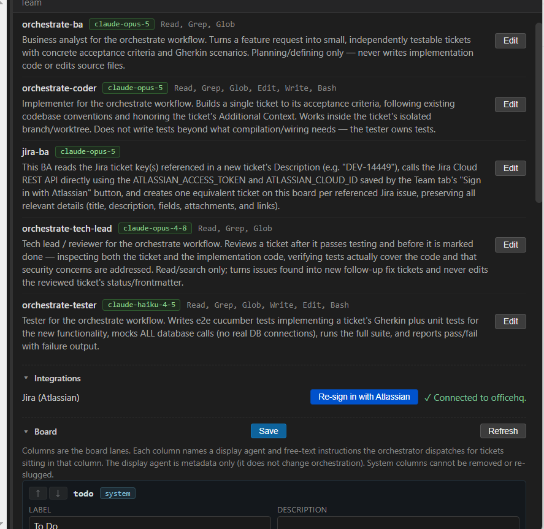

# Jira integration — "Sign in with Atlassian" + the jira-ba agent

## What it does and why

Lets a ticket like "get ticket from atlassian: DEV-14449" actually pull that
Jira issue in and turn it into a real local ticket, instead of sitting
undefined on the board waiting for someone to paste the details by hand.

Two pieces work together:

- **"Sign in with Atlassian"** — a button in the Team tab's **Integrations**
  section. It runs an OAuth 2.0 (3LO) flow (mirroring the existing "Sign in
  with Slack" button) and saves the resulting Jira access token to `.env`.
- **The `jira-ba` agent** (`.claude/agents/jira-ba.md`) — the orchestrate
  workflow's `defining` column agent (configured in
  `tasks/team-config.json`). When a ticket references one or more Jira issue
  keys, this agent calls the Jira REST API directly using the token from
  `.env` and creates one equivalent local ticket per referenced issue.

*The Team tab — the `jira-ba` agent in the Agents panel, and "Sign in with Atlassian" in the Integrations panel below it.*

## How it works

### Sign-in flow (`lib/atlassian-oauth.js`, `lib/atlassian.js`)

Modeled directly on the Slack OAuth flow (`lib/slack-oauth.js`, `lib/slack.js`):
an Electron-free module binds a loopback HTTP server on one of a fixed port
range (53801–53805), opens the system browser to Atlassian's authorize URL,
catches the redirect, checks the `state` CSRF token, and exchanges the code for
an access/refresh token — all unit-testable with mocked network
(`test/atlassian-oauth.test.js`, `test/atlassian.test.js`).

Atlassian's token is scoped to the user's account, not one site, so a
successful exchange is followed by one more call —
`GET https://api.atlassian.com/oauth/token/accessible-resources` — to resolve
which Jira site (cloud id) the token can reach. The first resource with a
`jira` scope (or the first resource, if none are scope-tagged) is used.

On success, `main.js`'s `atlassian:startOAuth` IPC handler persists (via
`lib/env-store.js`):

| Variable | Purpose |
|----------|---------|
| `ATLASSIAN_ACCESS_TOKEN` | Bearer token for Jira REST calls. |
| `ATLASSIAN_REFRESH_TOKEN` | Used to obtain a new access token once this one expires (re-run sign-in). |
| `ATLASSIAN_CLOUD_ID` | The resolved Jira site id — part of every Jira REST API URL. |
| `ATLASSIAN_SITE_URL` / `ATLASSIAN_SITE_NAME` | Shown in the Team tab as "Connected to `<site>`". |

`ATLASSIAN_CLIENT_ID` / `ATLASSIAN_CLIENT_SECRET` are the user's own OAuth app
credentials (from developer.atlassian.com/console/myapps), prompted for and
saved to `.env` the same way `ensureSlackClientCredentials` handles Slack's.

The renderer never holds the raw token: `atlassian:getStatus` returns only
`{ connected, siteUrl, siteName }`, which the Team tab's Integrations panel
(`refreshTeamIntegrations`) uses to show "Sign in with Atlassian" vs.
"✓ Connected to `<site>`".

### The `jira-ba` agent

Dispatched by the orchestrate workflow whenever a ticket sits in the `defining`
column (`tasks/team-config.json`'s `columns[].agent: "jira-ba"`). It:

1. Reads the ticket's Description for Jira issue keys (`[A-Z][A-Z0-9]+-[0-9]+`,
   e.g. `DEV-14449`).
2. Reads `ATLASSIAN_ACCESS_TOKEN` / `ATLASSIAN_CLOUD_ID` from `.env`. If either
   is missing, it stops and tells the user to click "Sign in with Atlassian"
   first — it never fabricates a ticket or guesses at credentials.
3. Calls `GET https://api.atlassian.com/ex/jira/<cloudId>/rest/api/3/issue/<key>`
   with `Authorization: Bearer <token>` for each referenced key.
4. Creates one local ticket per successfully retrieved issue and reports the
   Jira-key → local-ticket-id mapping back to the orchestrator, exactly like
   the generic BA's clarifying-question contract in
   [orchestrate-workflow.md](orchestrate-workflow.md).

## Configuration

See [`.env.example`](../.env.example) for the full variable list and the
Atlassian OAuth app setup steps (scopes `read:jira-work offline_access`,
callback URL registration).

## Edge cases and limitations

- **No `.env` token yet** → `jira-ba` reports this and does not create a
  placeholder ticket.
- **Expired/rejected token (401/403)** → reported clearly; re-running "Sign in
  with Atlassian" mints a fresh token.
- **No accessible Jira site** → the sign-in flow itself fails with an inline
  error rather than silently saving an unusable token.
- **Multiple keys in one ticket** → one local ticket is created per key.
